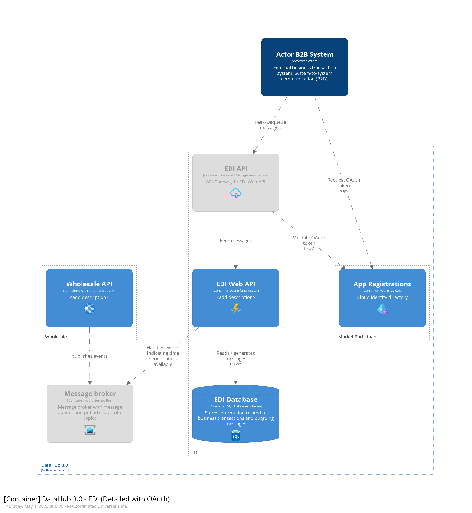

# EDI subsystem

## Intro

The EDI subsystem is responsible for handling incoming and outgoing message too and from DataHub.
EDI subsystem receives incoming requests from an actor and performs B2B validations on the request.
The request is then forwarded to relevant subsystem.
When a actor wishes to peek a message from DataHub. EDI is responsible for generating the message, and ensuring that the correct actor receives the message

## C4 Diagram of the Subsystem

## Getting Started

The source code of the repository is provided as-is. We currently do not accept contributions or forks from outside the project driving the current development.

For people on the project please read the internal documentation (Confluence) for details on how to contribute or integrate with the subsystem.

## Where can I get more help?

Read about community for Green Energy Hub [here](https://github.com/Energinet-DataHub/green-energy-hub) and learn about how to get involved and get help.

## Thanks to all the people who already contributed

