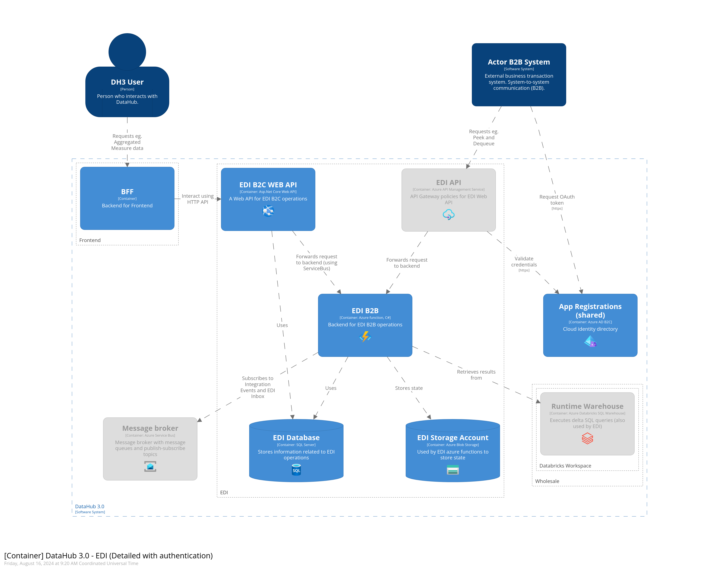

# EDI domain

## Intro

The EDI domain is responsible for handling incoming and outgoing message too and from DataHub.
EDI domain receives incoming requests from an actor and performs B2B validations on the request.
The request is then forwarded to relevant domain.
When a actor wishes to peek a message from DataHub. EDI is responsible for generating the message, and ensuring that the correct actor receives the message

## Architecture

## Getting Started

[Read here how to get started](https://github.com/Energinet-DataHub/green-energy-hub/blob/main/docs/getting-started.md).

## Where can I get more help?

Please see the [community documentation](https://github.com/Energinet-DataHub/green-energy-hub/blob/main/COMMUNITY.md)

## Thanks to all the people who already contributed

