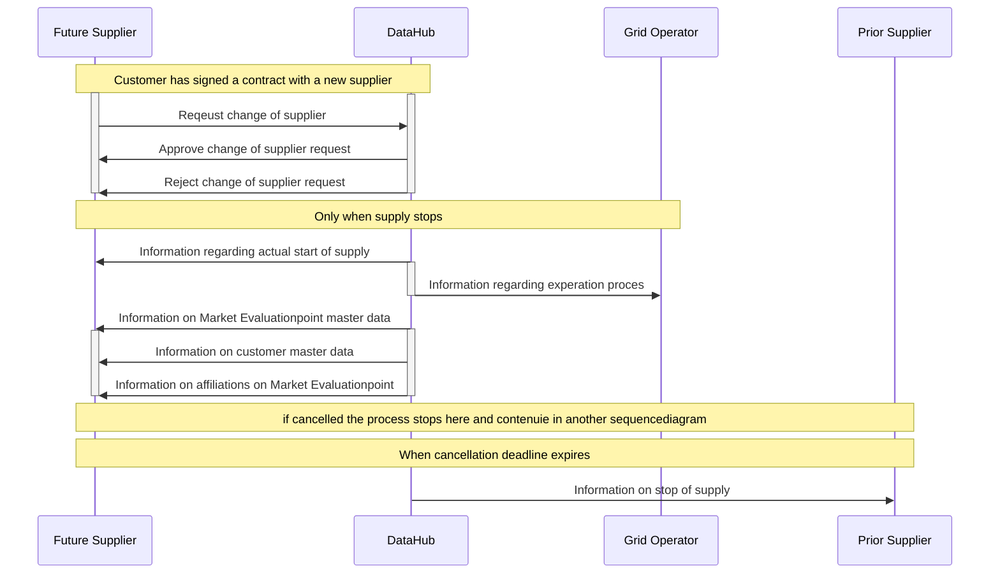
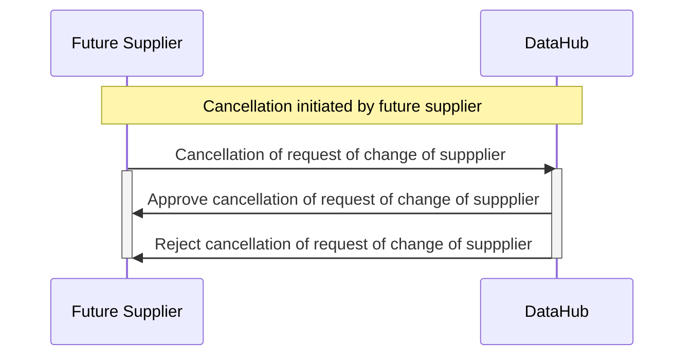

# Change of supplier (CoS)

## Process overview

A supplier can, if he has consent from a customer, request a change of supplier on a metering point (MP). This requires knowing either the social security number or the CVR number of the customer currently on the metering point.

Upon receival relevant [validation rules](docs\change-of-supplier-validations.md) are performed. If succesful, the energy supplier is registered as the future supplier on the MP.

This is done according to configurable parameters delimiting legal time frames for the process according to local laws.

Before the start date of the new supplier it is possible for the future supplier to send a cancellation cancelling the request.
When a request is cancelled the request is marked as cancelled and the requesting energy supplier is removed as a future supplier.

If there is an end of supply the process changes slightly. This is described in the [end of supply documentation](docs\end-of-supply.md).

## Implementation details

[Link to architecture](https://github.com/Energinet-DataHub/geh-market-roles#architecture)

The process manager that facilitates the entire flow has the following states:

| State                                       | Description                                                                                                                                                                                                                                                                                                                    |
| ------------------------------------------- | ------------------------------------------------------------------------------------------------------------------------------------------------------------------------------------------------------------------------------------------------------------------------------------------------------------------------------ |
| NotStarted                                  | Flow not started                                                                                                                                                                                                                                                                                                               |
| AwaitingConfirmationMessageDispatch         | Upon request receival the flow is initiated and we change our state to this first state. If it goes through our [list of validations](docs\change-of-supplier-validations.md), this will trigger the next state and mark the supplier as future spplier. If rejected the flow stops here and a validation report is generated. |
| AwaitingMeteringPointDetailsDispatch        | Awaiting Metering Point Master Data message to be generated and dispatched.                                                                                                                                                                                                                                                    |
| AwaitingConsumerDetailsDispatch             | Awaiting Consumer Master Data message to be generated and dispatched.                                                                                                                                                                                                                                                          |
| AwaitingCurrentSupplierNotificationDispatch | Awaiting message to be generated and dispatched to notify current supplier of the supplier change.                                                                                                                                                                                                                             |
| AwaitingSupplierChange                      | Supplier change is pending.                                                                                                                                                                                                                                                                                                    |
| Completed                                   | Future supplier is marked as current supplier and old supplier is stamped with an end date. Change of supplier process is completed and a supplier changed event is raised.                                                                                                                                                    |

 
 
Whenever a message is generated it is stored in the Outbox table. A timer job then runs through the Outbox at a given interval and dispatches the message to the Post Office and marks the message as dispatched.
